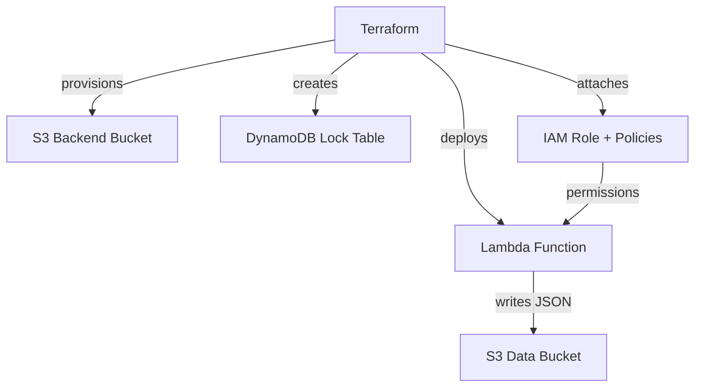

# 🚀 TASK 3

## 📘 Overview
This project provisions an **AWS Lambda function** with **Terraform**.  
The Lambda writes JSON objects into a **dedicated, account-unique S3 bucket**.  

We also use a **remote backend** with **S3 + DynamoDB** for Terraform state management.  

---

## 🛠 Project Structure
```text
project-root/
├── lambda/
│   ├── handler.py          # Lambda function code
│   └── requirements.txt    # Python dependencies
├── terraform/
│   ├── main.tf             # Infrastructure resources (Lambda, S3, IAM)
│   ├── variables.tf        # Terraform variables (region, project, environment)
│   ├── outputs.tf          # Terraform outputs (Lambda name, ARN, bucket, invoke cmd)
│   └── backend_bootstrap.sh # Script to create backend bucket + DynamoDB
```

---

## 🔑 Backend Setup
We use **S3 for Terraform state** and **DynamoDB for locking**.  

Run the bootstrap script **before first deploy**:

```bash
cd terraform
bash backend_bootstrap.sh
```

This will:  
- Create an S3 bucket named `spintech-terraform-state-<account_id>`  
- Enable versioning on it  
- Create DynamoDB table `terraform-locks`  
- Patch `main.tf` with the correct backend block  

---

## ⚙️ Deployment
```bash
cd terraform
terraform init
terraform plan -out=tfplan
terraform apply "tfplan"
```

### 📤 Outputs
After apply, Terraform will print:  
- **Lambda function name**  
- **Lambda ARN**  
- **Lambda S3 bucket name**  
- A ready-to-run **`aws lambda invoke` command**  

---

## 🧪 Testing the Lambda

1. Create a test event:
   ```bash
   echo '{"hello":"world"}' > event.json
   ```

2. Invoke the Lambda:
   ```bash
   aws lambda invoke \\
     --function-name spintech-lambda \\
     --region us-east-1 \\
     response.json
   cat response.json
   ```

   Expected output:
   ```json
   {
     "statusCode": 200,
     "body": "{\"message\": \"File saved to spintech-lambda-data-bucket-<account_id>/lambda-output/<timestamp>.json\"}"
   }
   ```

3. Verify in S3:
   ```bash
   aws s3 ls s3://spintech-lambda-data-bucket-<account_id>/lambda-output/
   ```

   Then view file:
   ```bash
   aws s3 cp s3://spintech-lambda-data-bucket-<account_id>/lambda-output/<timestamp>.json -
   ```

---

## 📦 Lambda Code
The Lambda (`handler.py`) writes JSON with a **message + timestamp** to the S3 bucket defined in the environment variable `BUCKET_NAME`.

Example JSON written:
```json
{
  "message": "Hello from Lambda!",
  "timestamp": "2025-09-16T01:39:35.655599"
}
```

---

## 🗺 Architecture



---

## 🔄 Changes from Original Repo

| **File**            | **Original Repo**                                                                 | **Fixed Version**                                                                                   | **Why it Changed** |
|----------------------|-----------------------------------------------------------------------------------|-----------------------------------------------------------------------------------------------------|--------------------|
| **`main.tf`**        | - No backend (local state only) <br> - Hardcoded bucket `my-super-cool-bucket` <br> - Lambda expected pre-uploaded `.zip` in S3 <br> - Old runtime `python3.8` <br> - IAM role without policies | - Remote backend: S3 + DynamoDB lock <br> - Unique bucket `${project}-lambda-data-bucket-<account>` <br> - Automated Lambda packaging with `archive_file` <br> - Runtime updated to `python3.9` <br> - IAM role with CloudWatch logging + S3 access policy | Makes project **portable**, avoids **BucketAlreadyExists**, enables **automated deploys**, adds **logging & S3 permissions** |
| **`handler.py`**     | - Returns only `"Hello from Lambda!"` <br> - No AWS integration <br> - No error handling <br> - No env vars | - Writes JSON to S3 bucket <br> - Uses `boto3` client <br> - Reads bucket from `BUCKET_NAME` env var <br> - Adds exception handling with 500 error response | Turns stub into **production-ready Lambda** with real **AWS integration** |
| **`requirements.txt`** | - Pinned to `boto3==1.18.67` (outdated) | - Just `boto3` (runtime provides latest version) | Keeps Lambda **lightweight**, avoids **dependency conflicts** |
| **`README.md`**      | - Minimal <br> - Titled *“Broken Terraform and Lambda Project”* <br> - Only vague debug steps | - Full guide (backend bootstrap, deploy, test) <br> - Clear outputs <br> - S3 verification steps <br> - Detailed changelog from original | Provides **step-by-step reproducible deployment**, documents **all fixes** |

---

✅ With these fixes, the project is **no longer a broken troubleshooting exercise** — it’s a **production-ready, portable AWS Lambda + Terraform example**.  
